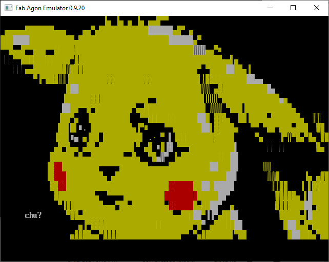

# ansiplay.bin
This is a MOS utility to play `.ANS` ANSI art files. Once the file is completely played, the player waits for a key press to exit. After exit, the readable portion of any available metadata is displayed before returning to MOS.

# Requirements
To properly function, this software requires a minimum of Console8 VDP v2.2.1 which allows quitting from the Terminal mode. It is most useful run as a MOSlet (i.e. copied to the `\mos` directory).

# Usage
Help is also included if the file is run without parameters.
ANSIplay [-x] <file>',CR,LF
	By default ANSIplay waits for any key to exit once done.
	-x will exit immediately after file is played.
	Ctrl-C to abort during play (slightly buggy - can't exit properly DURING an update).
	SAUCE metadata shown where available, including Title, Author, Group, Year and any available Comments.
	
# Sample
Here is an example of an ANSI graphics file being played:

