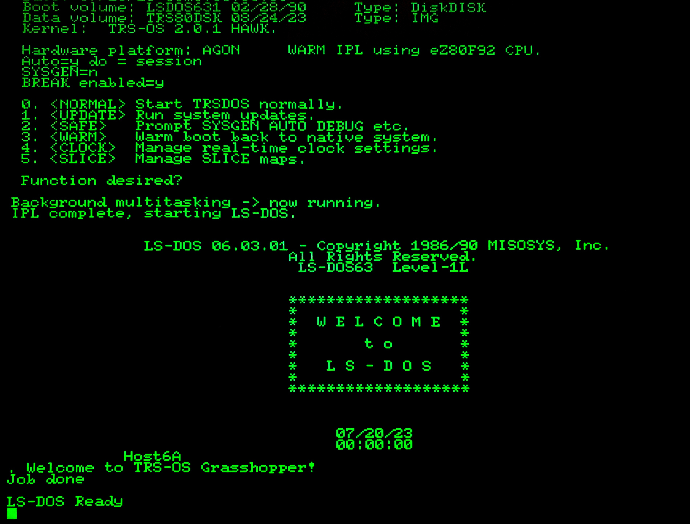

# OSboot
This tool is to boot up [TRS-OS](https://danielpaulmartin.com/home/research/). It only runs from the `/mos` directory. Only a binary is available at the moment. Source may be released in future. Booting TRS-OS allows well-behaved TRS-80 Model 4 software to run natively on Agon Light.

TRS-OS was designed and built by Danial Paul Martin as a way to run LS-DOS on modern (eZ80) based hardware, and is made available on Agon by a combination of Daniel's work on TRS-OS development along with my development of this loader. You can download the [TRS-OS binary via here](https://danielpaulmartin.com/how%20do%20i%20get/).

It is *highly* recommended that you update your VDP to include ADDS25 terminal emulation. At time of writing, this has not been merged into the main branch and required VDP files from [here](https://github.com/sijnstra/vdp-gl).

# What can I run with it?
Well behaved TRS-80 model 4 programs are able to run natively on Agon. This includes software on Tim Mann's site, among many others. This works because the TRS-OS operating system is a wrapper for LS-DOS 6.3.1, allowing Agon to boot an unmodified LS-DOS. The devices for keyboard `*KI` and display `*DO` are intercepted by a terminal emulation program, and use UART0 to communicate back the the Agon's VDP. This means the Agon VDP is an external terminal for LS-DOS running on the eZ80, so things like graphics (high or low res) are not yet available.

If you use the terminal updates above, this enables features like clear screen and reverse character text to work.

# Usage
`OSboot [-X] <binaryfile> [diskfile]`

The first optional parameter specifies the colour: `-1` (red) ... `-7` (white). Default is `-2` (green).

The `<binaryfile>` is the TRS-OS binary, downloaded using the link above.

The third optional parameter loads a virtual disk image into memory at `0x45300`, in JV1 or DiskDISK format, up to 210K in size. The image can be saved again upon reboot using [`memsave`](https://github.com/sijnstra/agon-projects/edit/main/memsave/). This means you can import and export files into TRS-OS. DiskDISK will allow you to have your disk geometry of choice, while JV1 is a much simpler format. There are a few programs out there to maipulate JV1 formats. I use them to create an 80 track single sided single density disk which fits in the 210k space.
