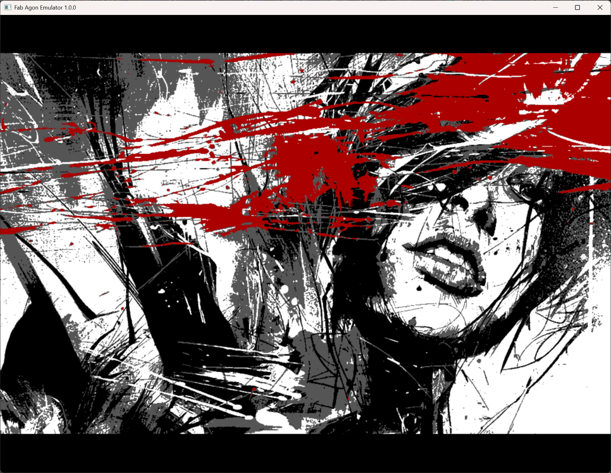

# PCXview
Loads a .PCX format image on Agon. The following formats are supported:

* Up to 640 x 480 in 16 colours
* Up to 800 x 600 in 4 colours
* Up to 1024 x 768 wide in 4 colours

The loader assumes that the x-offset and y-offset are zero, and that the image is in a single plane with 4 bits per pixel (for either 4 or 16 colours).

Images are first checked to see if they fit within 640x480, if not, then checked for 800x600, and finally 1024x768. If the image is too wide for 1024x768, the software will exit. If the image is too tall for 768, it will display the top 768 lines. The images are centred when displayed.

You can assemble using `ez80asm PCXview.asm` or download your the pre-built binary `PCXView.bin`.

# Why PCX?
There are a number of reasons why I chose to display this format on the Agon/Console8.
* It is an already existing format
* The format is supported by modern tools, including GIMP
* It uses a very simple form of compression ideal for 8 bit CPUs
* The specific choice of 16 colours has additional benefits:
  * The 16 colours are chosen from within the available 64 colour palette
  * The 16 colours allows the image to be sent to the VDP with 2 pixels per byte, speeding up the transfer

# GIMP support to create PCX images
Here are the high-level instructions on creating PCX images in GIMP, noting there are other utilities also supporting this format.
* Resize the image as required to a supported size, either by adjusting the canvas or scaling
* adjust the colour depth by selecting Image -> Mode -> Indexed... -> Generate optimum palette
  * Using 4 or 16 colours, depending on the size
* Export as PCX

# Usage
`PCXview file.PCX [1-9]`

The 1-9 is a single digit optional additional parameter to wait 1-9 seconds before exiting automatically. A keypress will still exit early. Without this parameter it will simply wait for a keypress.

Works in either /mos or /bin directory. Minimum VDP version 2.10.0.

There are some sample images provided in the Images directory, including provided by the [Public Domain Image Archive](https://pdimagearchive.org/).

# Roadmap items for development:
* Improve support for images taller than the screen
* Make the header and format checks more robust

# Example rendering
To give an idea of the possible image quality, this is one of the example images as displayed on the emulator:

