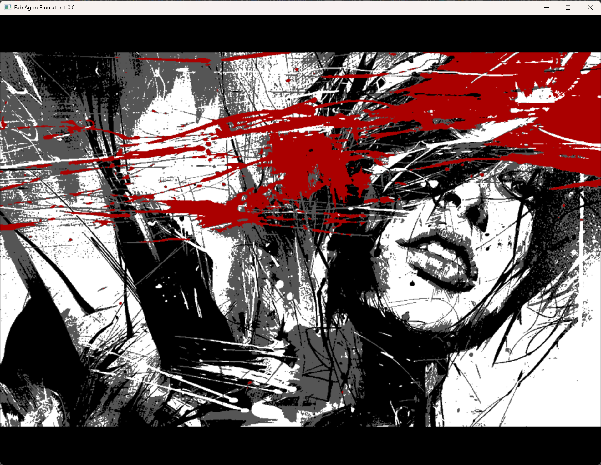

# PCXview
Loads a .PCX format image on Agon. The following sizes are supported:

* Up to 512 x 384 in 16 colours
* Up to 640 x 480 in 16 colours
* Up to 800 x 600 in 4 colours
* Up to 1024 x 768 wide in 4 colours

The image itself needs to be in a single plane with 4 bits per pixel (for either 4 or 16 colours), or 1 bit per pixel for monochrome. The viewer now also supports 2 bits per pixel for 4 colour images, however, it is difficult to create these image files so I have made a tool `PCX422` to support the conversion from 4 bits per pixel down to two.

Images are first checked to see if they fit within 512x384, if not, then checked for 640x480, if not, then checked for 800x600, and finally 1024x768. If the image is too wide for 1024x768, the software will exit. If the image is too tall for 768, it will display the top 768 lines. The images are centred when displayed.

# Building PCXview and PCX422
Both are written to use Envenomator's excellent ez80asm assembler so they can be built natively on Agon or on your favourite platform.

Take note that `init.asm`, `mos_api.inc`, and `equs.inc` are required to assemble either PCXview or PCX422. You can assemble using `ez80asm PCXview.asm` or download your the pre-built binary `PCXView.bin`, and similarly with PCX422.

# Why PCX?
There are a number of reasons why I chose to display this format on the Agon/Console8.
* It is an already existing format
* The format is supported by modern tools, including GIMP
* It uses a very simple form of compression ideal for 8 bit CPUs
* The specific choice of 16 colours has additional benefits:
  * The 16 colours are chosen from within the available 64 colour palette
  * The 16 colours allows the image to be sent to the VDP with 2 pixels per byte (or even 4 or 8 pixels per byte), speeding up the transfer

# GIMP support to create PCX images
Here are the high-level instructions on creating PCX images in GIMP, noting there are other utilities also supporting this format.
* Resize the image as required to a supported size, either by adjusting the canvas or scaling
* adjust the colour depth by selecting Image -> Mode -> Indexed... -> Generate optimum palette
  * Using 4 or 16 colours, depending on the size
* Export as PCX

Please note that GIMP is capable of saving supported PCX image files as 4 bits per pixel or 1 bit per pixel. A separate utility `PCX422` has been developed to convet 4 colour images stored in 4 bits per pixel down to 4 colour images stores as 2 bits per pixel images. GIMP will load the generated 2 bits per pixel images, however, Irfanview does not correctly interpret them (at the time of writing this).

# Usage
`PCXview file.PCX [1-9]`

The 1-9 is a single digit optional additional parameter to wait 1-9 seconds before exiting automatically. A keypress will still exit the viewing time early. Without this parameter it will simply wait for a keypress.

Works from the /mos directory. Minimum VDP version 2.10.0.

There are some sample images provided in the Images directory, including provided by the [Public Domain Image Archive](https://pdimagearchive.org/), as well as Shareware from Stephen A. Hornback - Softscene (MOUNT12A and MICHELLE) and Panthersoft Smartart (SAPR016)

I have also included a sample 4 colour AI generated image, including both 4 and 2 bits per pixel versions so you can compare the differences on a known working sample.

# Roadmap items for development:
* Improve support for images taller and wider than the screen
* Make the header and format checks more robust
* Support for 8bpp images
* Write some notes on Irfanview on conversion to PCX format

# Example rendering
To give an idea of the possible image quality, this is one of the example images as displayed on the emulator:

