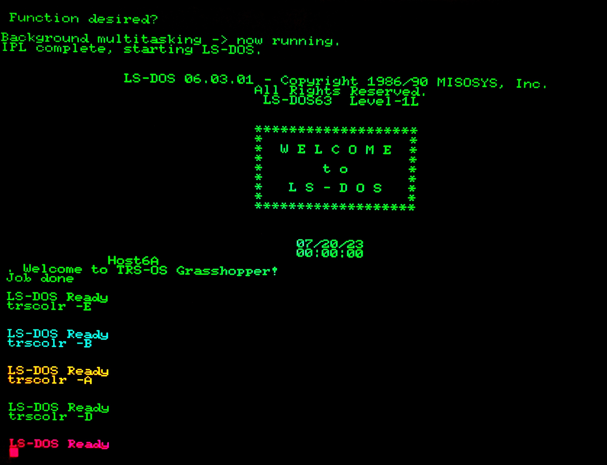

# TRSCOLR/CMD
This utility runs on TRS-OS on the Agon Light and is used to demonstrate Agon Light functinality under TRS-OS.

# Usage
`TRSCOLR -X`

The parameter `X` is a hex digit to specify the colour of text from the 16-colour palette: `-0` (black) ... `-F` (bright white)
