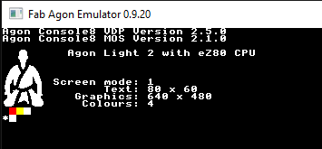
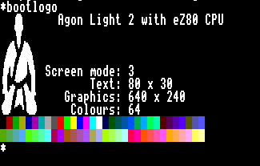

# bootlogo

This is a MOSlet to show an Agon boot logo including screen capabilities. It's written in 24-bit ADL mode and designed to be used only as a MOSlet. The code is a repurposed and re-written version of [Steve Lovejoy's Agon BBCBASIC logo header](https://github.com/The-8bit-Noob/AGON_BASIC_HEADER/).

# usage
Copy `bootlogo.bin` into your `/mos` then add `bootlogo` to the end of your `autoexec.txt`, and the software will display the current screen capabilities next to the Agon logo.

You can specify *any* parameter to suppress the colour bars. e.g. `bootlogo -` will show the logo except for the colour bars.

## Example screens:

# Source code
Source code is provided. The code can be compiled natively using `ez80asm`.

