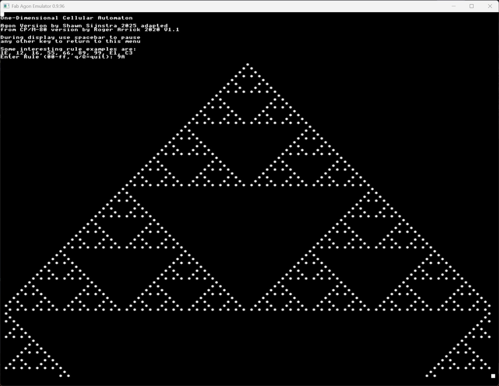

# ca1dagon.bin
This is a port of [Roger Arrick's CP/M 1-Dimensional Cellular Automaton](https://www.rogerarrick.com/ca1d/). The porting process consisted of converting from 8080 to z80 instructions, updating to comply with `ez80asm` standards, adding the Agon header, converting the I/O routines, debugging and finally other tweaks such as changing the screen size.

If you want to know more about the mathematics behind the parterns, use your favourite internet search engine for "Elementary Cellular Automaton".

# Source code
Source code is provided to help people who are looking for an exercise in writing something for the Agon in z80 mode using `ez80asm`. The code can be compiled natively on the Agon using `ez80asm`. The binary is included for those who simply want to run the program without compiling themselves.

To compile on your Agon, transfer the source file `ca1dagon.asm` on to your Agon. Assuming you already have `ez80asm` installed, you can simply use `ez80asm ca1dagon.asm` to compile the binary.

# Example
To give you an idea of what the software cab produce, here is one example of the 256 possible outputs:

