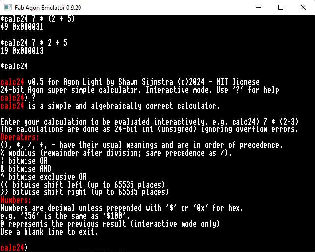

# calc24.bin
This is a MOS utility for performing 24 bit integer calculations in both hex and decimal. As it is written in 24 bit, it runs at the absolute address `0x0B0000` and is therefore recommended to run from your `/mos` directory.

# Source code
Source code is provided. When I set out to do this project, I couldn't find any real ez80 or even z80 based 24 bit routines covering the requirements. The code can be compiled natively using `ez80asm`.

The included routines are designed to be both compact and understandable.
## calc24.asm
This has the main parser, and calls routines from the two included libraries for string and arithmetic functions.
## strings24.asm
This has the routines that can print out 24-bit values in either hex or decimal
## arith24.asm
This has the routines for multiply, divide (and remainder), shift left, shift right. 

# Usage
You can either use it either interactively or from the command line. Help is also included. See screenshot for usage:

