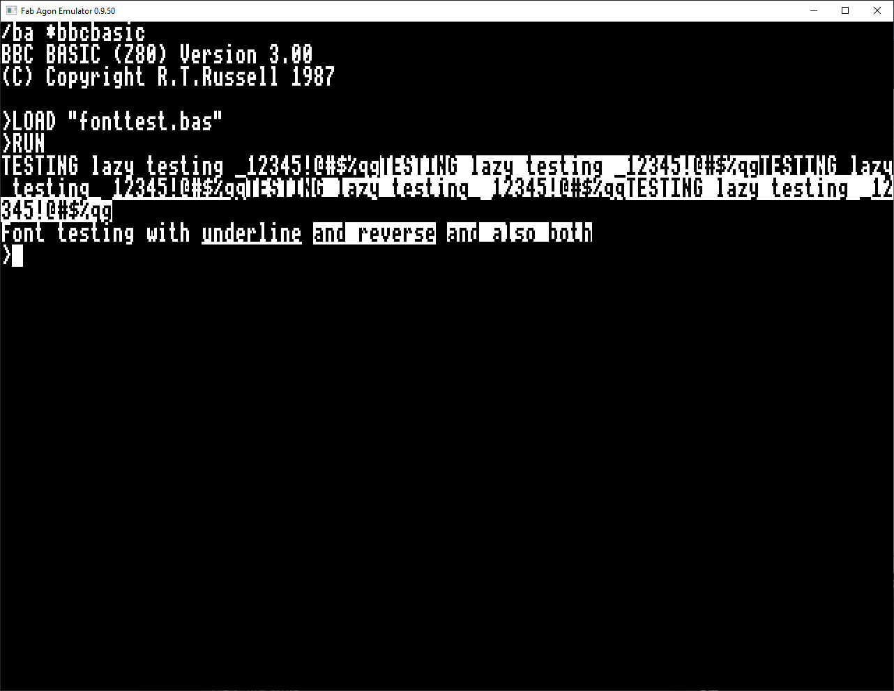

# fonttest.bas
This is a tool to demonstrate the creation of reverse text and underlines text fonts, using more recent Agon/Console8 VDP features for manipulating fonts in buffers. Minimum version of VDP is 2.8.1. The code is heavily commented and written in BBC BASIC.

# Usage
See the screenshot for the usage and output:

