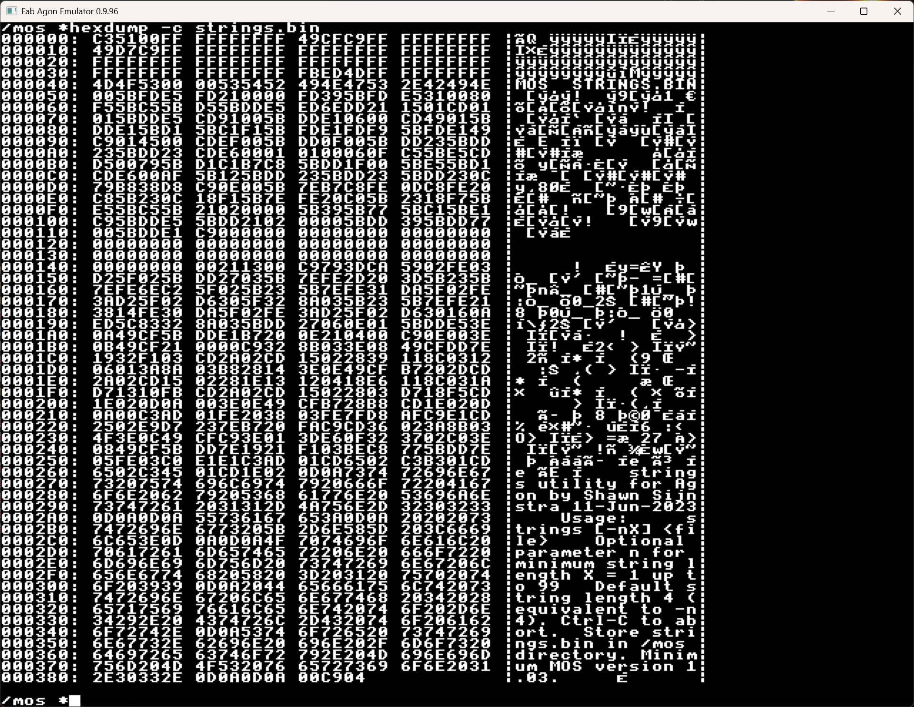

# hexdump

Usage: `hexdump [-c] <file>`

A simple `mos` utility to dump the content of any file, with columns showing file location, hex contents and all characters. This new version expects VDP 2.0.3 or higher to show the characters outside of the ASCII range of 32-127, and will not work properly on previous versions. If you have a previous version of VDP, use the GitHub interface to load the previous commit.

The default is now pages mode, allowing you to page forward and backward through the file. The option `-c` enables continuous mode, dumping the contents continuously to the display. In continuous mode `CTRL-C`, `ESC` or `q` will exit if needed.

