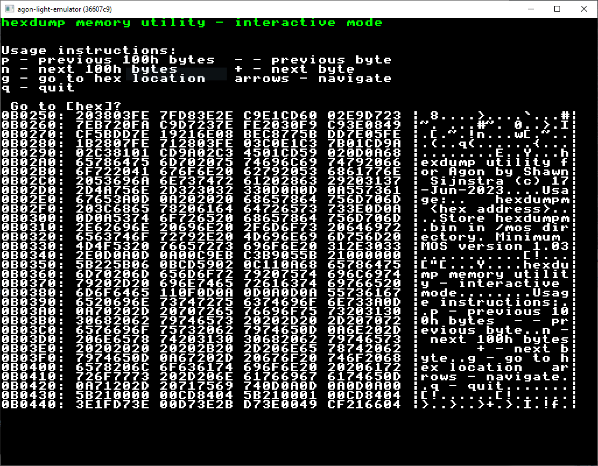

# hexdumpm

Usage: `hexdumpm <hex address>`

A simple `mos` utility to dump the content of memory, with columns showing memory location (in hex), hex contents and printable characters. The address can be 1 to 6 hex digits, which assumes leading zeros. No address specified will show usage instructions.

The interface is interactive only and shows the options.

