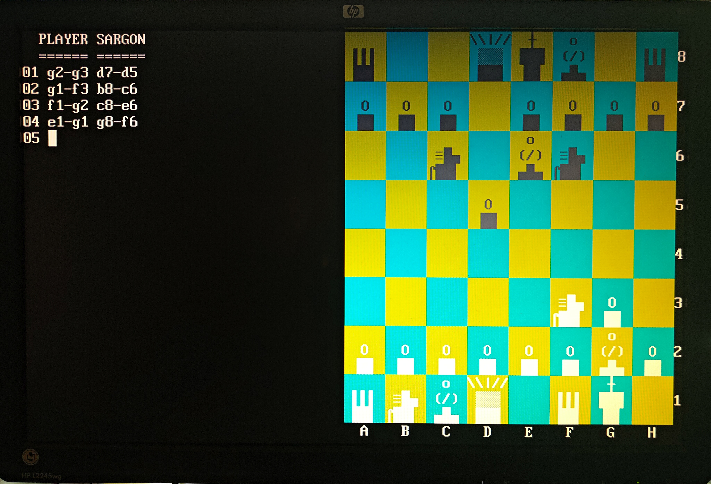

# sargon.bin
This is the classic. award-winning Sargon Chess program by Dan and Kathe Spracklen from 1978, which I have ported to run natively on Agon. It runs in terminal mode and can be executed as a moslet (ie. from the /mos directory)

Note that during setup it asks how many moves to look ahead - I find that anything more than 2 and you really need to be patient.

# Source code
Source code is not provided yet - it's compiled using ZDS-II and I'm looking at converting it to be more user-friendly.

# Roadmap
Now that it runs natively, I can make it more user-friendly on the Agon platform. This is what I am aiming to do over time:
<li>Convert to a more user-friendly assembler</li>
<li>Improve input methods such as optional joystick</li>
<li>Improve graphics</li>
<li>Add sound so you know when the computer is done</li>

# Screenshot

